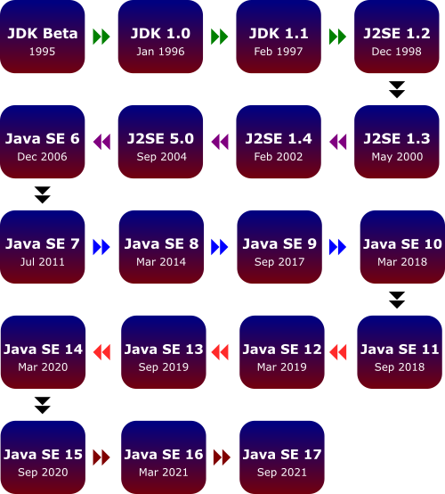

# Java_8_Features

**Table *of* Contens**
1. [Java Version history](#java-version-history)
2. [Java 8 Features](#java-8-features)
    - [Lambda expressions](#lambda-expression)
    - [Functional interface](#functional-interface)
    - [Method reference](#method-reference)
    - [Streams API](#streams-api)
3. [Resources](#resources)

---
## Java Version history
<br>

Since Java SE 9, newer Java versions follow every 6 months. 
But In the past, Java release cycles were much longer, up to 3-5 years.
<br>
Java 8, 11 and 17 are supported as Long-Term Support (LTS) versions.
That means the java vendor (for example Oracle) will support it for several years. This includes patching it for security issues.
Extended Support of java 8 is Until December 2030
a non-LTS version of java is only supported for 6 months!

---
## Java 8 Features
Java 8 was a massive release and you can find a list of all features at the [Oracle website](https://www.oracle.com/java/technologies/javase/8-whats-new.html).

### Lambda expression
A Lambda expression (or function) is an anonymous function (without any name or identifier, return type and access modifier.)

- Lambda expressions might be the biggest and most anticipated feature of Java 8. They are basically used to pass code instead of objects to a method or to deal with group of data to execute algorithms. This will produce much simpler and more readable code. 

```java
public void add(int a, int b) {
    System.out.println(a+b);
}
```

are equivalent

```java
(a, b) -> System.out.println(a+b);
```

__Syntax__:  (parameters) -> expression
<br>An arrow (->) is used to separate the list of parameters and the body.

Lambda expression features
- If the body of lambda expression has a single statement, curly brackets are not mandatory and the return type of the anonymous function is the same as that of the body expression. 
- When there is more than one statement in the body then these must be enclosed in curly brackets.
- The type of the parameters can be explicitly declared or it can be inferred from the context. 
- Multiple parameters are enclosed in mandatory parentheses and separated by commas. 
- Empty parentheses are used to represent an empty set of parameters. 
- When there is a single parameter, if its type is inferred, it is not mandatory to use parentheses.

Since java 8, we could use forEach method which is basically fetch the value from the added list and it will give the value. It is your job now to accept the value and perform the operation. <br> 
forEach is a method which came inside a interface called iterable and take consumer object  
And consumer is a functional interface which has only one abstract method accpet()
So in order to use forEach(), we need to create object of consumer, we need import the package 
```
import java.util.function.Consumer;
```
and this consumer we have mention it will work with what type of elements.

```java  
Consumer<Integer> cons = new Consumer<Integer>() {
    @Override
    public void accept(Integer integer) {

    }
}
```

```java
nums.forEach(new Consumer<Integer>() {
    @Override
    public void accept(Integer n) {
        System.out.print(n);
    }
});
```


lambda expression to iterate over a nums and perform some action on nums items.
accept the value in n and the same value will be printed
```java
nums.forEach( n -> System.out.print(n) );
```

<br>

### Functional Interface
- Functional interfaces are those interfaces which can have only one abstract method. 
- Before Java 8, interfaces could have only public abstract methods. It was not possible to add new functionality to the existing interface without forcing all implementing classes to create an implementation of the new methods, nor was it possible to create interface methods with an implementation.
- Starting with Java 8, interfaces can have  any number of static and default methods that, despite being declared in an interface, have a defined behavior.
- Annotate that with @FunctionalInterface, 

Static Interface Method	Default Method 
1. It is a static method which belongs to the interface only. We can write implementation of this method in interface itself
<br>It is a method with default keyword and class can override this method
2. Method Invocation
<br>Static method can invoke only on  interface class not on class.
<br>It can be invoked on interface as well as class
3. Method Name
<br>Interface and implementing class , both can have static method with the same name without overriding each other.
<br>We can override the default method in implementing class
4. Use Case
<br>It can be used as a utility method
<br>It can be used to provide common functionality in all implementing classes

here come up the common interview questions 
> Can we create an object of interface? <br>
the answer is no. but we can create an implementation
and then we can create the object

> can we create the object of the implementation of the interface? <br>
we can create a class which implements the interface and then we could create a object of the class


### Method reference
- Method reference is replacement of lambda expressions. It is used to refer method of Functional interface to an existing method. Mainly it is used for code reusability.
- Functional Interface’s abstract method can be mapped to specific existing method using double colon operator (::). 
- Whenever we have existing Implementation of Abstract method of our Functional interface then we can go for method reference.

### Streams API
Streams API in Java helps manipulating collections of data in a declarative way
Stream represents a sequence of objects from a source, which supports aggregate operations.
The stream API creates a stream of value you have and then you can do operations.

> Following are the characteristics of a Stream
> - Source − Stream takes Collections, Arrays, or I/O resources as input source.
> - Aggregate operations − Stream supports aggregate operations like filter, map, limit, reduce, find, match, and so on.
> - Pipelining − Most of the stream operations return stream itself so that their result can be pipelined. These operations are called intermediate operations and their function is to take input, process them, and return output to the target. collect() method is a terminal operation which is normally present at the end of the pipelining operation to mark the end of the stream.
> - Automatic iterations − Stream operations do the iterations internally over the source elements provided, in contrast to Collections where explicit iteration is required.

if we want change the nums[0] to 8, but we don't to change the existing list that will make it mutable. and if we work with lots data or multiple threads it's always better to have immutable data. Then we could use stream.

Code example here:
```java
List<Integer> nums = Arrays.asList(4,5,6,7,8);
        
Stream<Integer> data = nums.stream();

nums.stream()
        .filter(n -> n > 3)
        .sorted()
        .map((n -> n*2))
        .forEach(n -> System.out.println(n));
        
nums.forEach(n -> System.out.println(n));
```     
**_NOTE:_** The asList() method of java.util.Arrays class is used to return a fixed-size list backed by the specified array. This method acts as a bridge between array-based and collection-based APIs, in combination with Collection.toArray(). The returned list is serializable and implements RandomAccess.asList method returns a type of ArrayList that is different from java. util. ArrayList. The main difference is that the returned ArrayList only wraps an existing array — it doesn't implement the add and remove methods.


---

### Resources
https://www.cnblogs.com/CarpenterLee/p/6545321.html <br>
https://medium.com/javadeveloperdiary-jdd/understanding-streams-in-java-8-9ca2f33a3601 <br>
https://www.tutorialspoint.com/java8/java8_streams.htm <br>
https://www.baeldung.com/java-8-new-features <br>


